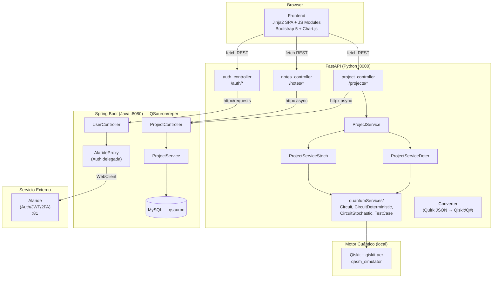
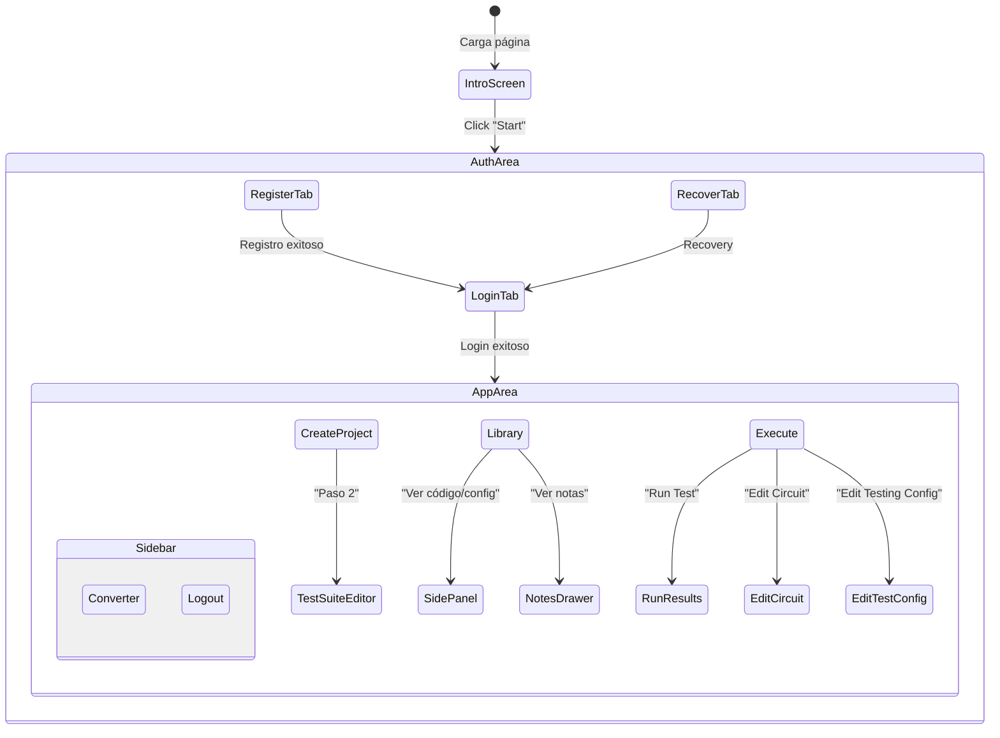

# Análisis Completo del Sistema QuTe — Base para Migración

## 1. Arquitectura Actual (QuTe)



**Resumen**: FastAPI actúa como **BFF (Backend-For-Frontend)**:
- Recibe peticiones del navegador
- Delega la **persistencia** al backend Java/Spring (proyectos, test suites, notas, usuarios)
- Ejecuta localmente la **simulación cuántica** con Qiskit-Aer
- Devuelve resultados (logs, imágenes base64, estadísticas) al frontend

---

## 2. Modelo de Datos — QSauron/reper (34 entidades JPA)

El modelo que **debe replicarse idéntico** en el nuevo backend. Las entidades clave para QuTe son:

### 2.1 Entidades Principales

```mermaid
erDiagram
    User {
        String id PK "email del usuario"
    }
    Project {
        String id PK
        String name
    }
    QProgram {
        String id PK
        int qubits
        int shots
        int[] inputQubits
        int[] outputQubits
    }
    QCode {
        int id PK "auto-generated"
        String platform "qiskit, qsharp..."
        String code "TEXT — código del circuito"
    }
    QCircuit {
        String id PK
        int qbits
        JsonNode quirkCode "JSON — formato Quirk columnar"
        String mutableColumns
        String mutableRows
    }
    Generator {
        int id PK "auto-generated"
        String type "GRENOBLE|MATRIX|GENETIC|GROVER|BLOCKS|EDITOR"
    }
    Expression {
        String id PK
    }
    TestSuite {
        String id PK
        int error_range
    }
    TestCase {
        String id PK
        int[] entryIndexes
        int[] outputIndexes
    }
    Deterministic {
        int[] entryValues
        int[] expectedValues
    }
    Stochastic {
        Map probabilityDistribution "TEXT — JSON Map<String,Integer>"
    }
    ProjectNote {
        String id PK
        String title
        String text
        String type "general|deter|stoch|bug|idea"
        Date timestamp
    }
    MutantCycle {
        String id PK
    }
    ExecConfig {
        Long id PK
        Date executionDate
        String machine
        String execAlgorithm
    }
    Mutant {
        String id PK
    }
    MutantResult {
        String id PK
    }
    KillingMatrix {
        Long id PK
    }

    User }o--o{ Project : "user_projects (M:N)"
    Project ||--o{ MutantCycle : "mutantCycles"
    Project ||--o{ TestSuite : "testSuites"
    Project ||--|| QProgram : "qProgram"
    Project ||--o{ ProjectNote : "projectNotes"
    QProgram ||--o{ QCode : "qCodes"
    QProgram ||--o{ Expression : "expressions"
    QProgram ||--|| QCircuit : "qCircuit"
    QProgram ||--o| Generator : "generator"
    TestSuite ||--o{ TestCase : "testCases"
    TestCase <|-- Deterministic : "DETERMINISTIC"
    TestCase <|-- Stochastic : "STOCHASTIC"
    MutantCycle ||--|| ExecConfig : "execConfig"
    MutantCycle ||--o{ Mutant : "mutants"
    ExecConfig ||--o| KillingMatrix : "killingMatrix"
```

### 2.2 Subtipos de Generator (herencia JOINED)

| Subtipo | Campos adicionales |
|---|---|
| **Grenoble** | `int qubits`, `int[] outputQubits`, `int[] inputQubits`, `String algorithm`, `String quirkCode` |
| **Matrix** | `int qubits`, `List<List<String>>` matrix (StringMatrixConverter) |
| **Genetic** | `int qubits`, `int population`, `int maxEvolutions`, `int tournamentSize`, `double mutationRate` |
| **Grover** | `int qubits` |
| **Blocks** | `int qubits`, `List<Block> blocks`, `List<BlockCircuit> blockCircuits` |
| **Editor** | `int qubits`, `List<EditorGates> editorGates` |

### 2.3 Converters personalizados
- [IntArrayDeserializer](file:///Users/samuel/Documents/Proyectos/QSauron/reper/src/main/java/edu/uclm/reper/model/IntArrayDeserializer.java): Deserializa JSON → `int[]`
- [ProbabilityDistributionConverter](file:///Users/samuel/Documents/Proyectos/QSauron/reper/src/main/java/edu/uclm/reper/model/ProbabilityDistributionConverter.java): JPA Converter `Map<String,Integer>` ↔ JSON TEXT
- [StringMatrixConverter](file:///Users/samuel/Documents/Proyectos/QSauron/reper/src/main/java/edu/uclm/reper/model/StringMatrixConverter.java): JPA Converter `List<List<String>>` ↔ JSON TEXT

---

## 3. Stack Técnico de QSauron/reper (a replicar)

| Componente | Versión |
|---|---|
| **Spring Boot** | `4.0.2` |
| **Java** | `21` |
| **Maven** | pom.xml con parent spring-boot-starter-parent |
| **Packaging** | `war` |
| **spring-boot-starter-data-jpa** | (managed) |
| **spring-boot-starter-webflux** | (managed) — WebClient para proxies |
| **spring-boot-starter-web** | (managed) |
| **jackson-databind/core/annotations** | (managed) |
| **mysql-connector-j** | `8.3.0` |
| **httpclient5** | (managed) |
| **jakarta.json.bind-api** | `3.0.1` |
| **spring-boot-starter-tomcat** | provided |
| **spring-boot-starter-test** | test |
| **netty-resolver-dns-native-macos** | osx-aarch_64 |

### Perfiles de configuración

| Perfil | BD | Alaride URL | CORS |
|---|---|---|---|
| **local** | `localhost:3306/qsauron` root/pass | `localhost:81` | `*` |
| **prod** | producción | producción | restricto |
| **test** | test | test | — |

---

## 4. Lógica de Negocio Completa del Sistema QuTe

### 4.1 Autenticación

| Flujo | Descripción |
|---|---|
| **Register** | Frontend → `POST /auth/register` (FastAPI) → `POST /users/create` (Spring) → Spring guarda User en MySQL y delega a AlarideProxy para registrar en el servicio de auth externo |
| **Login** | Frontend → `POST /auth/login` (FastAPI) → `POST /users/login` (Spring) → AlarideProxy → Alaride. Devuelve JWT. FastAPI lo guarda en sesión + cookie `SESSION_TOKEN` (httpOnly) |
| **2FA** | Spring soporta activación 2FA, verificación de código y refresh token via AlarideProxy |
| **Logout** | Frontend → limpia UI. Spring invalida cookie y llama `alarideProxy.logout()` |
| **Recover** | Frontend → `POST /forgot_password` (no implementado en FastAPI actual). Spring tiene `RecoveryController` completo |

> [!IMPORTANT]
> La autenticación NO es propia de Spring — se delega 100% a un servicio externo **Alaride** (JWT + 2FA + recovery). Spring actúa como proxy. QuTe/FastAPI habla con Spring, que a su vez habla con Alaride.

### 4.2 Gestión de Proyectos

| Operación | Endpoint FastAPI | Endpoint Spring | Lógica |
|---|---|---|---|
| **Crear proyecto** | `POST /projects/save_full` | `PUT /projects/save` | Recibe nombre, email, modo, circuito(.py), cut_config(JSON). Construye payload con `qProgram`, `testSuites`, `qcodes`. Spring persiste todo en cascada |
| **Listar proyectos** | `GET /projects/?user_email=` | `POST /projects/getAllByUser` | Spring devuelve lista. FastAPI normaliza con `spring_to_projectindb()` |
| **Obtener proyecto** | (interno) | `POST /projects/getProject` | Obtiene un proyecto completo por email+projectId |
| **Editar circuito** | `PUT /projects/{name}/circuit` | `PUT /projects/save` | Modifica `qcodes[0].code` y re-salva todo el proyecto |
| **Editar test config** | `PUT /projects/{name}/test_config` | `PUT /projects/updateTestSuites` | Actualiza testSuites, shots, inputs/outputs, error_range |
| **Eliminar proyecto** | `DELETE /projects/{name}` | `DELETE /projects/{name}` | Borra por ID |
| **Obtener CUT config** | `GET /projects/{name}/cut_config` | `POST /projects/getProject` | Extrae y reconstruye la configuración legacy |
| **Tabla I/O** | `GET /projects/{name}/oi_table` | `GET /projects/{name}` | Construye tabla de qubits input/output |

### 4.3 Ejecución de Tests (Motor Cuántico — **SOLO en Python/Qiskit**)

> [!WARNING]
> **Esta es la lógica más crítica.** La ejecución cuántica ocurre SOLO en el backend Python (FastAPI + Qiskit-Aer). Spring NO ejecuta nada cuántico. En la nueva arquitectura habrá que decidir dónde colocar esta lógica.

#### Flujo Determinístico
1. Obtener proyecto de Spring → extraer `circuit_code` y `test_suite`
2. Escribir circuito en `/tmp/circuit.py` → cargar módulo Python dinámicamente → obtener `QuantumCircuit` (CuT)
3. Por cada caso `[input, expected_output]`:
   - Construir QTCC: registros auxiliares (expected, check, verdict), preparar entradas, aplicar CuT como instrucción, comparar con CCX, veredicto con MCX
   - Ejecutar en `qasm_simulator` con N shots
   - Resultado: `'1'` en counts → PASS, else FAIL
4. Devolver logs `"Input: X → Expected: Y → Verdict: Z"` + imágenes base64 de CuT y QTCC

#### Flujo Estocástico
1. Misma obtención de proyecto y carga de circuito
2. Por cada caso `[expected_output, expected_probability]`:
   - Construir QTCC estocástico: preparar entradas, aplicar CuT, medir outputs directamente
   - Ejecutar con N shots → obtener `counts` dict
   - Calcular % de hits para la salida esperada
   - Comparar con probabilidad esperada ± tolerancia (`error_range`)
3. Devolver `percentages[]` con stats por caso + imágenes base64

#### Preparación de Qubits (QTCC Input Init Values)
Tokens permitidos: `""` (noop), `"0"`, `"1"` (X), `"h"` (H), `"y"` (Y), `"z"` (Z), `"s"` (S), `"t"` (T)

### 4.4 Converter (Quirk JSON → Código)
Convierte JSON en formato columnar (editor Quirk) a código ejecutable:
- **Qiskit**: Genera función `create_cut_circuit()` con `QuantumCircuit`, registros, puertas H/X/Y/Z/S/T y controladas (CX, CCX)
- **Q#**: Genera `namespace QuantumCircuits` con operación equivalente

### 4.5 Notas de Proyecto
| Operación | Endpoint FastAPI | Endpoint Spring |
|---|---|---|
| **Listar** | `GET /notes/?user_email=` | `POST /projects/getAllByUser` + N× `POST /notes/list` (concurrente) |
| **Crear** | `POST /notes/` | `POST /notes/create` |
| **Actualizar** | `PUT /notes/{id}` | `PUT /notes/{id}` |
| **Eliminar** | `DELETE /notes/{id}` | `DELETE /notes/{id}` (con body) |

Tipos de nota: `general`, `deter`, `stoch`, `bug`, `idea`

---

## 5. Vistas del Frontend (11 componentes HTML + 12 módulos JS)

### 5.1 Mapa de Navegación



### 5.2 Detalle de cada Vista/Componente

#### 🔐 Auth Area (`_auth.html`, `_login.html`, `_register.html`, `_recover.html`, `_auth_tabs.html`)
- **Intro Screen**: Logo Alarcos + título "QuTe" + botón "Start"
- **Login Tab**: Email + password → `login()` → oculta auth, muestra sidebar+main
- **Register Tab**: Email + password → `register()` → alert
- **Recover Tab**: Email → `recoverPassword()` (parcialmente implementado)
- Tabs de navegación: Login | Register | Recover

#### 📁 Sidebar (`_sidebar.html`)
4 opciones de navegación + logout:
1. **Create Project** → `openTab('createProject')`
2. **Library** → `openTab('libro')` — carga `renderProjectLibrary()`
3. **Execute** → `openTab('project')` — carga `populateProjectSelect()`
4. **Converter** → `openTab('converter')`
5. **Log out** → `logout()`

#### ➕ Create Project (`_create_project.html`)
**Sección 1 — Metadatos del proyecto:**
- Project Name (text)
- Collaborator (text, opcional)
- Project Description (textarea)
- Mode: select `deterministic` | `stochastic`
- Upload Circuit: file input (`.py`, `.txt`)
- Botones: Cancel | Create Project

**Sección 2 — Test Suite Editor** (`cutEditorSection`, se muestra tras crear):
- Error Range (solo modo stochastic)
- Input Indexes (text, ej: `0,1`)
- Output Indexes (text, ej: `2,3`)
- Initial Values per qubit: selectores dinámicos con opciones `""|0|1|h|y|z|s|t`
- Shots (number)
- Test Cases: formulario dinámico `+ Add case` (cada caso: input bits + output bits)
- Alternativa: Import Test Suite (JSON file)
- Botones: Back | Save Test Suite

#### 📚 Library (`_library.html`)
- Grid de tarjetas de proyecto (2 columnas, paginado a 6)
- Cada tarjeta muestra: nombre, usuario, cooperador, descripción
- Acciones por tarjeta: 🗑 Delete | Circuit code | Testing Config | Notes
- **Side Panel** (`codeSidePanel`): panel lateral para previsualizar código o configuración con botones Copy/Clear
- Paginación inferior

#### ▶️ Execute (`_project.html`)
**Layout de 2 columnas:**

*Columna izquierda — Circuit Code:*
- Select de proyecto (dropdown poblado dinámicamente)
- Textarea con código del circuito (readonly por defecto)
- Botones: Edit Circuit → Save Circuit Changes | Cancel

*Columna derecha — Test Configuration:*
- Vista readonly: Input/Output Indexes, Shots, Error Range, tabla I/O
- Botón "Edit Testing Config" → formulario de edición inline
- Formulario de edición: Input/Output Indexes, Shots, Error Range, Test Cases dinámicos

**Ejecución:**
- Botón "Run Test" → llama a `POST /projects/{name}/run_tests`
- Terminal: barra de progreso
- Botón FAB flotante "📝" para abrir Notes Drawer

**Resultados:**
- **Determinístico**: Lista de veredictos `Input: X → Expected: Y → Verdict: Z`
- **Estocástico**: Tabla de porcentajes + gráfico Chart.js con barras de hits vs expected
- Imágenes base64 de circuito CuT y QTCC

#### 🔄 Converter (`_converter.html`)
- File input para JSON del circuito (formato Quirk)
- Select: Qiskit | Q#
- Botón Convert → genera código en textarea
- Botón Download Code → descarga como archivo

#### 📝 Notes Drawer (`_notes_drawer.html`)
- Overlay + panel lateral deslizante
- Header: "Notes" + botón Close
- Toolbar: botón "New"
- Formulario: título, tipo (select: general|deter|stoch|bug|idea), texto (textarea)
- Botones: Save | Clean

### 5.3 Módulos JavaScript (12 archivos)

| Módulo | Responsabilidad | LOC |
|---|---|---|
| [main.js](file:///Users/samuel/Documents/Proyectos/QuTe/appDeter/Frontend/presentation/static/js/main.js) | Entry point, imports, expone funciones a `window` | 78 |
| [state.js](file:///Users/samuel/Documents/Proyectos/QuTe/appDeter/Frontend/presentation/static/js/state.js) | Estado global: `projects`, `loggedIn`, `selectedProject`, `currentMode`, `API_BASE` | 48 |
| [auth.js](file:///Users/samuel/Documents/Proyectos/QuTe/appDeter/Frontend/presentation/static/js/auth.js) | Login, register, recover, logout | 135 |
| [ui.js](file:///Users/samuel/Documents/Proyectos/QuTe/appDeter/Frontend/presentation/static/js/ui.js) | `startApp()`, `openTab()`, `openAuthTab()`, `toggleSidebar()`, reset fields | 110 |
| [projects.js](file:///Users/samuel/Documents/Proyectos/QuTe/appDeter/Frontend/presentation/static/js/projects.js) | CRUD proyectos, renderizar library, seleccionar proyecto, crear proyecto, cargar CUT config | 970+ |
| [execute.js](file:///Users/samuel/Documents/Proyectos/QuTe/appDeter/Frontend/presentation/static/js/execute.js) | Editar circuito, editar test config, guardar cambios, run tests, mostrar resultados | 600+ |
| [converter.js](file:///Users/samuel/Documents/Proyectos/QuTe/appDeter/Frontend/presentation/static/js/converter.js) | Convertir JSON → Qiskit/Q#, descargar código | 60 |
| [notes.js](file:///Users/samuel/Documents/Proyectos/QuTe/appDeter/Frontend/presentation/static/js/notes.js) | CRUD notas, drawer open/close, renderizar lista de notas | 220+ |
| [utils.js](file:///Users/samuel/Documents/Proyectos/QuTe/appDeter/Frontend/presentation/static/js/utils.js) | Helpers: viewCutCode, viewTestingCode, addTestCaseField, resetForm, base64, formatLogs | 200+ |
| [projects_deterministic.js](file:///Users/samuel/Documents/Proyectos/QuTe/appDeter/Frontend/presentation/static/js/projects_deterministic.js) | Renderizar resultados determinísticos | 180+ |
| [projects_stochastic.js](file:///Users/samuel/Documents/Proyectos/QuTe/appDeter/Frontend/presentation/static/js/projects_stochastic.js) | Renderizar resultados estocásticos, tabla de porcentajes | 380+ |
| [stochasticOther.js](file:///Users/samuel/Documents/Proyectos/QuTe/appDeter/Frontend/presentation/static/js/stochasticOther.js) | Gráfico Chart.js para resultados estocásticos | 170+ |

---

## 6. Endpoints REST Completos

### 6.1 Endpoints FastAPI actuales (a migrar/reimplementar)

| Método | Ruta | Función |
|---|---|---|
| `GET` | `/` | Servir SPA |
| `POST` | `/auth/register` | Registro (form data) |
| `POST` | `/auth/login` | Login (form data) → cookie SESSION_TOKEN |
| `POST` | `/projects/save_full` | Crear proyecto completo |
| `GET` | `/projects/?user_email=` | Listar proyectos normalizados |
| `PUT` | `/projects/{name}/circuit` | Actualizar código del circuito |
| `DELETE` | `/projects/{name}` | Eliminar proyecto |
| `POST` | `/projects/{name}/run_tests` | Ejecutar tests cuánticos |
| `PUT` | `/projects/{name}/test_config` | Actualizar test suite |
| `GET` | `/projects/{name}/cut_config` | Obtener configuración CUT |
| `GET` | `/projects/{name}/oi_table` | Obtener tabla I/O |
| `GET` | `/notes/?user_email=` | Listar proyectos con notas |
| `POST` | `/notes/` | Crear nota |
| `PUT` | `/notes/{id}` | Actualizar nota |
| `DELETE` | `/notes/{id}` | Eliminar nota |

### 6.2 Endpoints Spring Boot existentes (QSauron/reper)

| Método | Ruta | Controller |
|---|---|---|
| `POST` | `/users/create` | UserController |
| `POST` | `/users/login` | UserController |
| `POST` | `/users/getUser` | UserController |
| `POST` | `/users/activate2FA` | UserController |
| `POST` | `/users/verify2FACode` | UserController |
| `POST` | `/users/refreshToken` | UserController |
| `POST` | `/users/logout` | UserController |
| `POST` | `/projects/create` | ProjectController |
| `POST` | `/projects/getAllByUser` | ProjectController |
| `PUT` | `/projects/save` | ProjectController |
| `POST` | `/projects/delete` | ProjectController |
| `POST` | `/projects/getProject` | ProjectController |
| `POST` | `/projects/getAllByUserSummary` | ProjectController |
| `POST` | `/projects/getProjectDetails` | ProjectController |
| `POST` | `/projects/associate` | ProjectController |
| `POST` | `/recovery/request` | RecoveryController |
| `POST` | `/recovery/validate` | RecoveryController |
| `POST` | `/recovery/reset` | RecoveryController |

---

## 7. Dependencias Externas y Servicios

| Servicio | URL | Función |
|---|---|---|
| **Alaride** | `http://localhost:81` (local) / prod | Autenticación JWT, 2FA, recovery |
| **MutantAnalytics** | `http://localhost:8503` | Analytics de mutantes (proxy en Spring) |
| **MySQL** | `localhost:3306/qsauron` | Base de datos relacional |

---

## 8. Preguntas Abiertas para la Planificación

> [!IMPORTANT]
> ### Decisiones críticas antes de crear el plan de implementación:

1. **Motor cuántico (Qiskit)**: Actualmente la ejecución cuántica corre en Python/Qiskit dentro de FastAPI. En la nueva arquitectura (Spring Boot + Angular):
   - **Opción A**: Mantener un microservicio Python separado solo para la ejecución cuántica (Spring lo llama vía HTTP)
   - **Opción B**: Ejecutar Python desde Java vía ProcessBuilder/GraalPy
   - **Opción C**: Migrar la lógica cuántica a una librería Java (si existe equivalente)
   - ¿Cuál prefieres?

2. **Relación con QSauron/reper existente**: ¿El nuevo backend QuTe va a compartir la misma base de datos que QSauron/reper (es el mismo Spring Boot desplegado), o va a ser una instancia separada con el mismo modelo?

3. **Funcionalidad de mutantes**: El modelo de reper incluye MutantCycle, Mutant, MutantResult, ExecConfig, KillingMatrix, etc. ¿QuTe necesita toda esta funcionalidad de mutación testing, o solo el subconjunto de Project + TestSuite + QProgram?

4. **Converter (Quirk → Qiskit/Q#)**: ¿Se mantiene esta funcionalidad en la nueva app? ¿Dónde se ejecuta?

5. **Estilo del frontend Angular**: Mencionaste que lo definiremos después, pero ¿tienes alguna referencia visual o palette de colores preferida?

6. **Alaride**: ¿El nuevo backend seguirá delegando auth a Alaride o implementará autenticación propia (Spring Security + JWT)?

7. **Backup del código actual**: ¿Movemos `appDeter` a `appDeter_backup` o simplemente lo dejamos y creamos las carpetas `backend/` y `frontend/` al lado?
